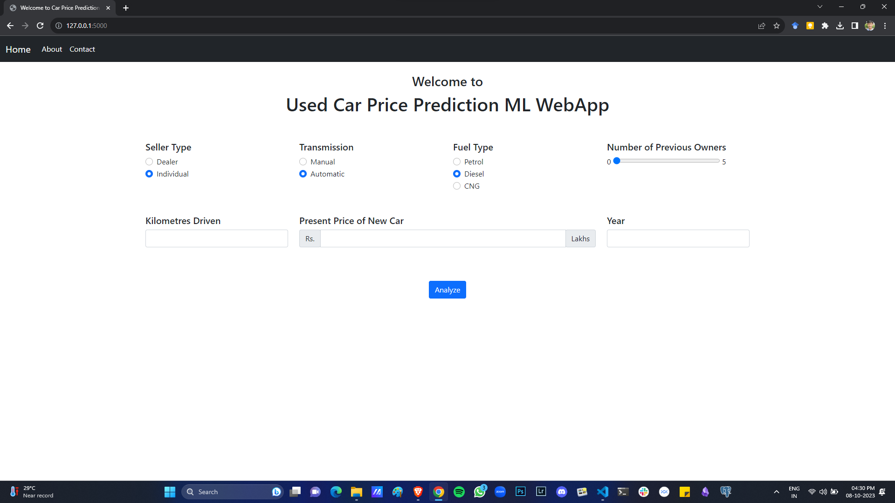
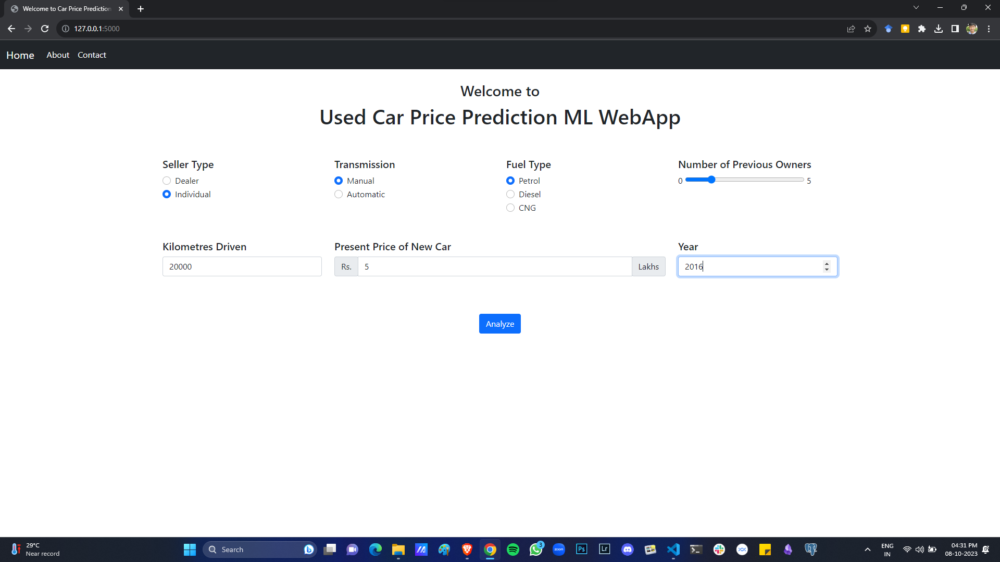
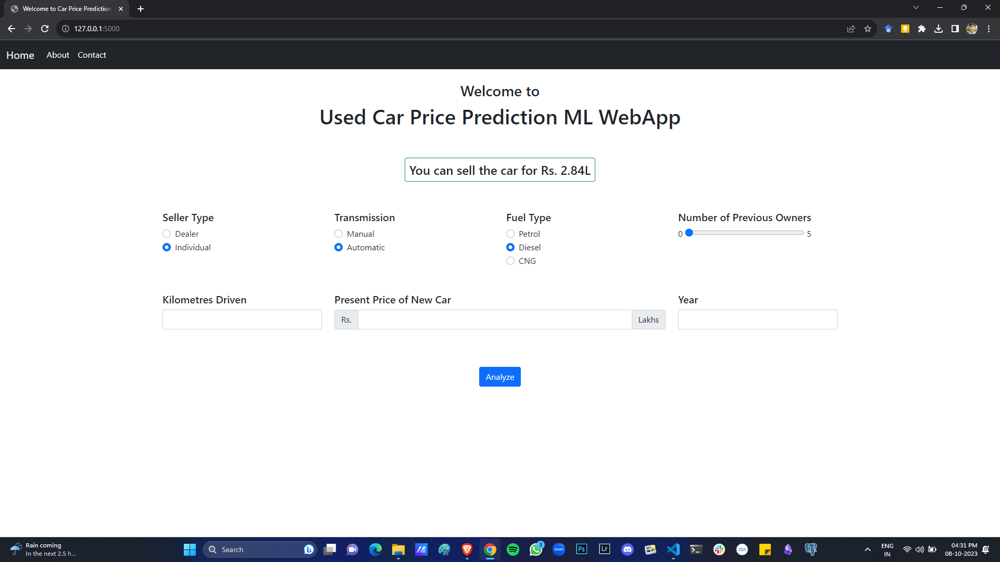

# Used Car Price Prediction using Machine Learning

[](https://GitHub.com/sinjoysaha/Car-Price-Prediction-ML-WebApp/graphs/contributors/)
[](https://GitHub.com/sinjoysaha/Car-Price-Prediction-ML-WebApp/network/)
[](https://GitHub.com/sinjoysaha/Car-Price-Prediction-ML-WebApp/stargazers/)
[](https://GitHub.com/sinjoysaha/Car-Price-Prediction-ML-WebApp/watchers/)
[](https://GitHub.com/sinjoysaha/Car-Price-Prediction-ML-WebApp/issues/)
[](https://github.com/sinjoysaha?tab=followers)
[](https://linkedin.com/in/sinjoysaha)
[](https://twitter.com/SinjoySaha)

## Table of Contents

* [About the Project](#about-the-project)
  * [Demo Pages](#demo-pages)
  * [Built With](#built-with)
* [Contact](#contact)

## About the Project


In this [`ML Project`](https://github.com/sinjoysaha/Car-Price-Prediction-ML-WebApp) I try to build a ML model which predicts the price of a used car. The ML model used is a Random Forest Regressor, which takes in features such as `Seller Type`, `Transmission Type`, `Fuel Type`,  `#Previous Owners`, `Distance Driven`, `Current Price of New Car`, and `Year`. The model was implemented into a web app using `Flask` and deployed on Heroku.

The [`Jupyter Notebook`](https://github.com/sinjoysaha/Car-Price-Prediction-ML-WebApp/blob/main/Car_Price_Prediction_Model.ipynb) used for data cleaning, EDA, and model training is also given.

The data is taken from this Kaggle [dataset](https://www.kaggle.com/datasets/nehalbirla/vehicle-dataset-from-cardekho) - Original Source: CarDekho. 

NOTE: Due to recent changes in Heroku's free tier plan, the Heroku link is currently not available. However, one can easily run a local version of the web app by following the steps below.

Clone this repo and `cd` into the base directory. 

Install the dependencies using `requirements.txt`.
```shell
pip install -r requirements
```

Then, run the `app.py` using Python. 
```shell
python app.py
```

## Demo Pages
[](https://github.com/sinjoysaha/Car-Price-Prediction-ML-WebApp)

[](https://github.com/sinjoysaha/Car-Price-Prediction-ML-WebApp)

[](https://github.com/sinjoysaha/Car-Price-Prediction-ML-WebApp)

### Built With

* Python
* Scikit Learn
* Pandas
* Flask
* HTML
* BootStrap

## Contact

Sinjoy Saha 

  [](https://linkedin.com/in/sinjoysaha)
  [](https://twitter.com/SinjoySaha)
  [](mailto:sinjoysaha555@gmail.com)

